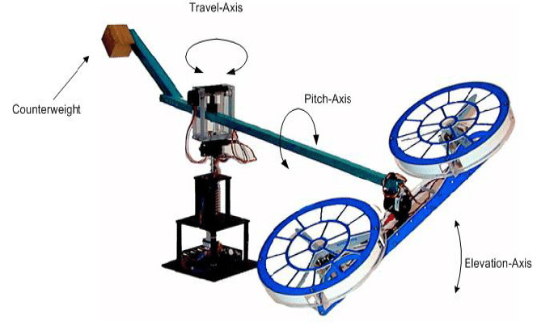

# Three-Degree-of-Freedom Quanser Helicopter Setup

This GitHub project focuses on the analysis and control of a three-degree-of-freedom Quanser helicopter. The project involves several key steps:

1. **Equation of Motion:** Deriving the system's equations of motion using the Euler-Lagrange method.

2. **Simulation:** Simulating the open-loop nonlinear system using Msc Adams and Matlab Simulink.

3. **State Formulation:** Defining the equations in state-space form.

4. **Stability Analysis:** Investigating Bounded Input Bounded Output (BIBO) stability using Lyapunov and marginal methods.

5. **Controllability and Observability:** Assessing system controllability and observability.

6. **Controller Design:** Designing a state feedback controller.

7. **Robustness Analysis:** Evaluating controller robustness against input and model parameter variations.

This repository aims to provide a comprehensive overview of the process, from system modeling to controller design, in a step-by-step manner.

## Usage
Each step of the process is documented in detail within the repository. You can navigate through the folders to find code, simulations, and explanations for each stage.

## Contributing
Contributions and suggestions are welcome. If you find any issues or have ideas for improvements, feel free to open an issue or pull request.

## License
This project is licensed under the [MIT License](LICENSE).

